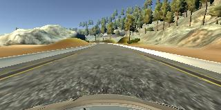
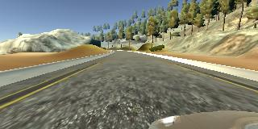
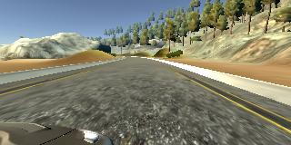
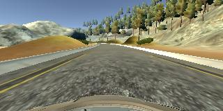
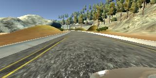
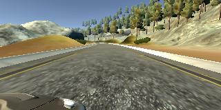

# P3: Behavioural Cloning
The objective of this project is to train a model that teaches a car to drive around a track in Udacity's simulator.

This README contains info on

1. Files in this repo
2. Dataset characteristics
    * How data was captured
    * What data was recorded
3. Solution Design
    * Problem objective
    * Pre-processing of input data
    * Approach taken for designing model architecture
4. Model architecture

## 1. Files in this repo
* `model.py`: Python script to import data, train model and save model.
* `model.json`: Model architecture.
* `model.h5`: Model weights (Large file, > 300MB).
* `drive.py`: Python script that tells the car in the simulator how to drive
* `data/`: file with training data
    * Attributes such as 'steering angle' mapped to image paths in `driving_log.csv`.
    * Images in `IMG/`.
* `p3-bcloning-model.ipynb`: Notebook I am developing the model in. Has nice visualisations.

## 2. Dataset Characteristics

### Data Generation: Udacity's Car-Driving Simulator
The model was trained by driving a car in the left-hand-side track of Udacity's car-driving simulator. The simulator recorded 9-10 datapoints per second. Each datapoint comprised 7 attributes:
* Image taken from the center camera on the car (320 x 160 pixel image with 3 colour channels)
* Image taken from the left camera on the car
* Image taken from the right camera on the car
* Throttle
* Speed
* Brake
* Steering angle (variable to predict, a float ranging from -1.0 to 1.0 inclusive)

### What data was recorded
1. Whole laps: I recorded driving the car around the training track for two to three laps. 
2. Recovery: I then recorded driving the car only from the side of the road to the center, both along straight roads and along curves. This was so the model could learn to drive back to the center of the road if it swerved to the side. I did not record driving off to the side of the road because that's not something I want the model to do.

#### Sample Data
Here are two examples of images and attributes from the dataset.

Example One: Curve







<table>
<th>Steering Angle</th><th>Throttle</th><th>Brake</th><th>Speed</th>
<tr><td>-0.3281459</td><td>1</td><td>0</td><td>20.86732</td></tr>
</table>

Example Two: Straight road







<table>
<th>Steering Angle</th><th>Throttle</th><th>Brake</th><th>Speed</th>
<tr><td>0</td><td>0.6794708</td><td>0</td><td>30.11689</td></tr>
</table>


### How the model was trained
The model was trained using the center image as input (X) and the steering angle as the variable to predict (y). Around 3000 datapoints were used to train the model.

Due to limitations in GPU memory, I fed training examples in batches of 50. (See *Model Architecture* for details on the model.)


## 3. Solution Design

### Objective
The target is for the car to drive within the lane lines, so the main features the model needs to recognise from the center image are the lane lines.

### Pre-processing of input data
The X input fed into the model are the original unprocessed images taken by the camera.

* I considered converting the images into black images with lane lines traced in white (as in the Lane Lines project), but did not do that because the model will be tested in a simulator and likely cannot do such processing within the simulator (and do it in real time - the lane lines test video was 7 seconds long but it took longer than 7 seconds to trace out lane lines on top of the video.)
    * It will be interesting to see if the model can learn to drive within the lane even with so many irrelevant features in the image.
* I also considered resizing the image (reducing dimensions by a factor of 10) but was not sure if that could translate into the simulator.

### Approach taken for designing model architecture

#### Convolutions
* Convolutions generally seem to perform well on images, so I tried adding a few convolution layers to my model.
    * Hand-wavey reasoning: I wanted the model to recognise the lane lines were lane lines no matter where the model found them. 
* It was less clear whether convolutions were a good idea because translations and slight rotations of shapes (lane lines) matter a lot here. It's not like cases of image classification where regardless of where the cat in the image is, it's still a cat. If the car is to the side of the lane, it should steer differently than if it is in the center of a lane.

#### Activations and Dropout
* Activation to introduce non-linearities into the model: I chose ReLU as my activation.
    * ReLU: `h = max(0,a) where a = Wx + b`.
    * Reduced likelihood the gradient (wrt the weights) will vanish when `a > 0`, vs sigmoids where the gradient becomes smaller as the magnitude of x increases.
        * Constant gradients of ReLUs -> Faster learning.
    * Sparsity: arises when `a <= 0`. With ReLUs, the resulting representation becomes more sparse when there are more of these units. Sigmoids are much less likely to generate such units, resulting in more dense representations which are (for some reason) not preferred. 
    * BUT ReLUs tend to blow up the activation (make it large) since there is no mechanism to constrain the output of the neuron, so `a` is the output.
* I added dropout to prevent the network from overfitting.

References: [Advantages of ReLU over sigmoid functions in DNNs](http://stats.stackexchange.com/questions/126238/what-are-the-advantages-of-relu-over-sigmoid-function-in-deep-neural-network)

#### Fully connected layer
* I added a fully connected layer after the convolutions to allow the model to perform high-level reasoning on the features taken from the convolutions.

#### Final layer
* This is a regression and not a classification problem since the output (steering angle) is continuous, ranging from -1.0 to 1.0.
    * So instead of ending with a softmax layer, I used a 1-neuron fully connected layer as my final layer.

*Aside: I planned on using an Adam optimiser but realised I didn't.*


## 4. Model architecture
Is the model architecture documented?

The model is a Sequential model comprising two blocks of convolution layers and one block of fully-connected layers. If we include ReLU, maxpooling, dropout and input reshaping layers, the model has 17 layers. The model 

Each block of convolution layers comprises:
* Convolution (ReLU Activation) -> Convolution (-> ReLU Activation) -> MaxPooling (-> Dropout)

The block of fully connected layers comprises:
* A Flatten layer -> Fully-connected (Dense) layer (-> ReLU Activation) -> Dropout -> Fully-connected layer.

The specifications of the model are below:
```
model = Sequential()
model.add(Convolution2D(160, 3, 3, border_mode='same',
                        input_shape=(160,320,3)))
model.add(Activation('relu'))
model.add(Convolution2D(32, 3, 3))
model.add(Activation('relu'))
model.add(MaxPooling2D(pool_size=(2, 2)))
model.add(Dropout(0.25))

model.add(Convolution2D(64, 3, 3, border_mode='same'))
model.add(Activation('relu'))
model.add(Convolution2D(64, 3, 3))
model.add(Activation('relu'))
model.add(MaxPooling2D(pool_size=(2, 2)))
model.add(Dropout(0.25))

model.add(Flatten())
model.add(Dense(512))
model.add(Activation('relu'))
model.add(Dropout(0.5))
model.add(Dense(1))

sgd = SGD(lr=0.01, decay=1e-6, momentum=0.9, nesterov=True)
model.compile(loss='mean_squared_error',
              optimizer=sgd,
              metrics=['accuracy'])
              
batch_size = 100
nb_epoch = 10
```
