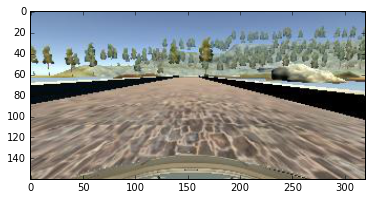
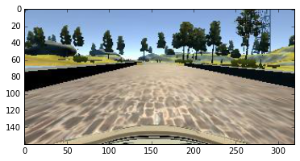
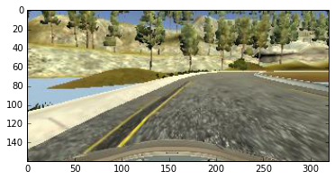

# P3: Behavioural Cloning
The objective of this project is to train a model that teaches a car to drive around a track in Udacity's simulator.

This README contains info on

1. Files in this repo
2. Dataset characteristics
    * How data was captured
    * What data was recorded
3. Solution Design
    * Problem objective
    * Pre-processing of input data
    * Approach taken for designing model architecture
4. Model architecture

## 1. Files in this repo
* `model.py`: Python script to import data, train model and save model.
    * [Video of the model driving](https://www.youtube.com/watch?v=WCat1CpKQc4) 
* `model.json`: Model architecture.
* `model.h5`: Model weights (Large file, > 300MB).
* `drive.py`: Python script that tells the car in the simulator how to drive
* `data/`: file with training data (no longer in repo)
    * Attributes such as 'steering angle' mapped to image paths in `driving_log.csv`.
    * Images in `IMG/`.
* `p3-behavioural-cloning.ipynb`: Notebook with final model.
* `p3-explore.ipynb`: Notebook I developed the model in. It contains more rough work than `p3-behavioural-cloning.ipynb`.

## 2. Dataset Characteristics

### Data Generation: Udacity's Car-Driving Simulator
The model was trained by driving a car in the left-hand-side track of Udacity's car-driving simulator. The simulator recorded 9-10 datapoints per second. Each datapoint comprised 7 attributes:
* Image taken from the center camera on the car (320 x 160 pixel image with 3 colour channels)
* Image taken from the left camera on the car
* Image taken from the right camera on the car
* Throttle
* Speed
* Brake
* Steering angle (variable to predict, a float ranging from -1.0 to 1.0 inclusive)

### What data was recorded

I ended up using Udacity's data and recovery data from another student (Annie Flippo), but here is how I gathered my initial data:

I recorded myself driving around Track 1 first using the keyboard and then (when available) using the mouse.

1. Whole laps: I recorded driving the car around the training track for two to three laps. 
2. Recovery: I then recorded driving the car only from the side of the road to the center, both along straight roads and along curves. This was so the model could learn to drive back to the center of the road if it swerved to the side. I did not record driving off to the side of the road because that's not something I want the model to do.

I did not use my own data in the end because adding my data made my car seem like it was drink-driving. :)

#### Sample Data
Here are three examples of images and attributes from the dataset.

Example One: Left turn



<table>
<th>Steering Angle</th><th>Throttle</th><th>Brake</th><th>Speed</th>
<tr><td>-0.923744</td><td>0.668526</td><td>0.0</td><td>29.98325</td></tr>
</table>

Example Two: Straight road



<table>
<th>Steering Angle</th><th>Throttle</th><th>Brake</th><th>Speed</th>
<tr><td>0.000000</td><td>0.000000</td><td>0.0</td><td>22.14829</td></tr>
</table>


Example Three: Right turn



<table>
<th>Steering Angle</th><th>Throttle</th><th>Brake</th><th>Speed</th>
<tr><td>1.000000</td><td>0.495593</td><td>0.0</td><td>20.15795</td></tr>
</table>


### How the model was trained
The model was trained using the center image as input (X) and the steering angle as the variable to predict (y). Around 9000 datapoints were used to train the model. I divided these examples into training and validation sets using `sklearn.model_selection.train_test_split` to reduce overfitting.

Due to limitations in GPU memory, I fed training examples in batches of 32 using a generator. (See *Model Architecture* for details on the model.)


## 3. Solution Design

### Objective
The target is for the car to drive within the lane lines, so the main features the model needs to recognise from the center image are the lane lines.

### Pre-processing of input data
The X input fed into the model are the original unprocessed images taken by the camera. They are of size 160x320 pixels with 3 channels (RGB).

#### Pre-processing steps:

* Crop away parts of the test image that are irrelevant to determining the steering angle (parts that don't include the track).
    * i.e. crop away the top 50 rows of pixels and bottom 20 rows of pixels).
* Resize the image (make it smaller) to reduce dimensions of the input data.
* Normalise image because normalised input data empirically produces more accurate models. The intuition may be to make the model more robust to changes in e.g. lighting. 

All these preprocessing steps were taken inside the model so that these steps could:

1. be easily applied to new input images as they came in, and
2. make the most of parallelised computing if available to reduce computation time.

### Approach taken for designing model architecture

#### Convolutions

* Convolutions generally seem to perform well on images, so I tried adding a few convolution layers to my model.
    * Hand-wavey reasoning: I wanted the model to recognise the lane lines were lane lines no matter where the model found them. 
* It was less clear whether convolutions were a good idea because translations and slight rotations of shapes (lane lines) matter a lot here. It's not like cases of image classification where regardless of where the cat in the image is, it's still a cat. If the car is to the side of the lane, it should steer differently than if it is in the center of a lane.

#### Activations and Dropout
* Activation to introduce non-linearities into the model: I chose ELU as my activation. 
* I added dropout to prevent the network from overfitting.

#### Aside:
I also tried using ReLU as my activation:
* ReLU: `h = max(0,a) where a = Wx + b`.
* Reduced likelihood the gradient (wrt the weights) will vanish when `a > 0`, vs sigmoids where the gradient becomes smaller as the magnitude of x increases.
* Constant gradients of ReLUs -> Faster learning.
* Sparsity: arises when `a <= 0`. With ReLUs, the resulting representation becomes more sparse when there are more of these units. Sigmoids are much less likely to generate such units, resulting in more dense representations which are (for some reason) not preferred. 
* BUT ReLUs tend to blow up the activation (make it large) since there is no mechanism to constrain the output of the neuron, so `a` is the output.

References: [Advantages of ReLU over sigmoid functions in DNNs](http://stats.stackexchange.com/questions/126238/what-are-the-advantages-of-relu-over-sigmoid-function-in-deep-neural-network)

#### Fully connected layer
* I added a fully connected layer after the convolutions to allow the model to perform high-level reasoning on the features taken from the convolutions.

#### Final layer
* This is a regression and not a classification problem since the output (steering angle) is continuous, ranging from -1.0 to 1.0.
    * So instead of ending with a softmax layer, I used a 1-neuron fully connected layer as my final layer.
    * I also considered adding a `tanh` activation to ensure output was in the range (-1.0,1.0). This means the model will necessarily predict 'wrongly' when y = 1.0 or -1.0 when training, but the number of such cases (2 in the training set) is small and there is no diffeence between the model outputting a steering angle of 0.9999 and 1.0 in practice.


## 4. Model architecture

Of all the models I tried, the model adapted from Comma.ai's model worked best. I also tried (1) a scaled-down version of NVIDIA's pipeline and (2) various combinations of conv layers combined with fully connected layers.

The model is a Sequential model comprising three convolution layers and three fully-connected layers. The model weights used were those obtained after training for **20 epochs**.

The model code and specifications are below:
```
model = Sequential()

# Crop 70 pixels from the top of the image and 25 from the bottom
model.add(Cropping2D(cropping=((70, 25), (0, 0)),
                     dim_ordering='tf', # default
                     input_shape=(160, 320, 3)))

# Resize the data
model.add(Lambda(resize_comma))

# Normalise the data
model.add(Lambda(lambda x: (x/255.0) - 0.5))

# Conv layer 1
model.add(Convolution2D(16, 8, 8, subsample=(4, 4), border_mode="same"))
model.add(ELU())

# Conv layer 2
model.add(Convolution2D(32, 5, 5, subsample=(2, 2), border_mode="same"))
model.add(ELU())

# Conv layer 3
model.add(Convolution2D(64, 5, 5, subsample=(2, 2), border_mode="same"))

model.add(Flatten())
model.add(Dropout(.2))
model.add(ELU())

# Fully connected layer 1
model.add(Dense(512))
model.add(Dropout(.5))
model.add(ELU())

# Fully connected layer 2
model.add(Dense(50))
model.add(ELU())

model.add(Dense(1))

adam = Adam(lr=0.0001)

model.compile(optimizer=adam, loss="mse", metrics=['accuracy'])

```

Specs in a table:

<table>
	<th>Layer</th><th>Details</th>
	<tr>
		<td>Convolution Layer 1</td>
		<td>
			<ul>
				<li>Filters: 16</li>
				<li>Kernel: 8 x 8</li>
				<li>Stride: 4 x 4</li>
				<li>Padding: SAME</li>
				<li>Activation: ELU</li>
			</ul>
		</td>
	</tr>
	<tr>
		<td>Convolution Layer 2</td>
		<td>
			<ul>
				<li>Filters: 32</li>
				<li>Kernel: 5 x 5</li>
				<li>Stride: 2 x 2</li>
				<li>Padding: SAME</li>
				<li>Activation: ELU</li>
			</ul>
		</td>
	</tr>
	<tr>
		<td>Convolution Layer 3</td>
		<td>
			<ul>
				<li>Filters: 64</li>
				<li>Kernel: 5 x 5</li>
				<li>Stride: 2 x 2</li>
				<li>Padding: SAME</li>
				<li>Activation: ELU</li>
			</ul>
		</td>
	</tr>
	<tr>
		<td>Flatten layer</td>
		<td>
			<ul>
			</ul>
		</td>
	</tr>
	<tr>
		<td>Fully Connected Layer 1</td>
		<td>
			<ul>
				<li>Neurons: 512</li>
				<li>Dropout: 0.5</li>
				<li>Activation: ELU</li>
			</ul>
		</td>
	</tr>
   	<tr>
		<td>Fully Connected Layer 2</td>
		<td>
			<ul>
				<li>Neurons: 50</li>
				<li>Activation: ELU</li>
			</ul>
		</td>
	</tr>

	<tr>
		<td>Fully Connected Layer 3</td>
		<td>
			<ul>
				<li>Neurons: 1</li>
				<li>Activation: tanh</li>
			</ul>
		</td>
	</tr>

</table>

## 5. Discussion

1. I could not run some models because they had too many parameters and both my laptop and the AWS server I rented ran out of memory. (E.g. I had to adjust the parameters on the NVIDIA model to reduce the total number of parameters from over 5 billion to 1.7 million.)
    * I successfully ran these models after adding a `subsample` parameter to reduce the number of parameters in each layer.
2. It was hard to compare performance of parameter tweaks rigorously because it's hard to quantify the model's performance on the track. Is driving into the water better or worse than driving into the mountains? I had to use my intuition and a rough measure of how far the car got along the track and how stably it was driving to measure performance and direct how I was tweaking parameters or using different datasets.
3. DNNs still seem like a black box. In the end what made my car able to drive through the whole track was adding high quality recovery data, not adjusting the model. This shows the importance of the data you put into the model. 
4. Strangely a trained model that worked (drove around the track fine) on Thurs 16 Feb did not work on Friday 17 Feb. I used the same simulator and ran the model three times on Thursday (it worked each time) and at least three times on Friday (it did not work even once).
