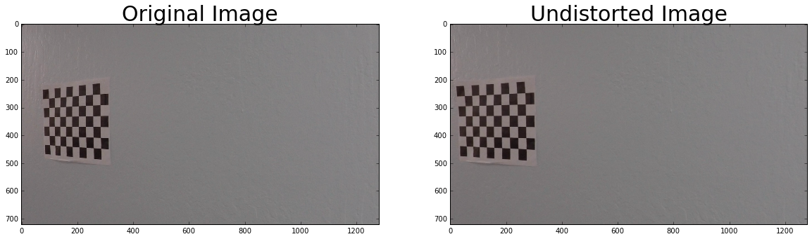
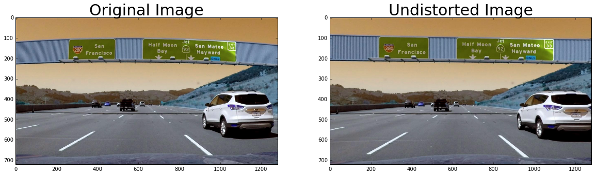
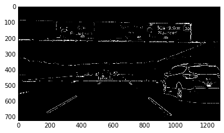
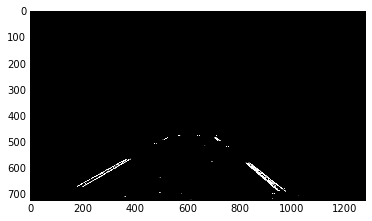
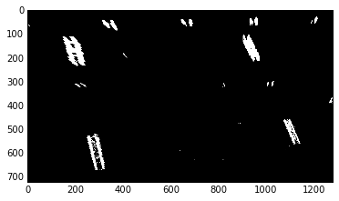
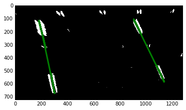
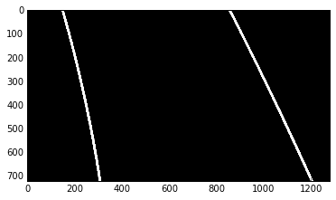
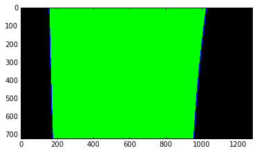
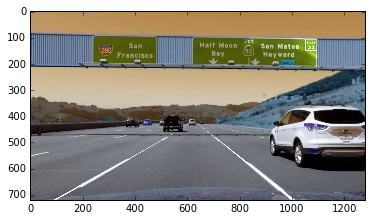
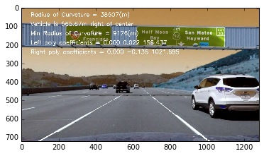

# Advanced Lane Finding

[](http://www.udacity.com/drive)

### Project Instructions
The goals / steps of this project are the following:  

* Compute the camera calibration matrix and distortion coefficients given a set of chessboard images.
* Apply the distortion correction to the raw image.  
* Use color transforms, gradients, etc., to create a thresholded binary image.
* Apply a perspective transform to rectify binary image ("birds-eye view"). 
* Detect lane pixels and fit to find lane boundary.
* Determine curvature of the lane and vehicle position with respect to center.
* Warp the detected lane boundaries back onto the original image.
* Output visual display of the lane boundaries and numerical estimation of lane curvature and vehicle position.

### Navigating this directory
* Project pipelines are in `p4-advanced-lane-lines.ipynb`.
* Helper functions are in `helperfunctions.py`.
* The images for camera calibration are stored in the folder called `camera_cal`.  
* The images in `test_images` are for testing your pipeline on single frames.


## Project Outline:
The code for each step is in the correspondingly named section of `p4-advanced-lane-lines.ipynb`.

## I. Camera Calibration

### 1. Computing the camera matrix and distortion coefficients
This was done in Step 1 of the ipynb.
* Read in calibration images.
* Generate object points (points I want to map the chessboard corners to in the undistorted image).
* Find the image points (chessboard corners) using `cv2.findChessboardCorners`.
* Calibrate the camera and obtain distortion coefficients using `cv2.calibrateCamera`.

#### Example of a distortion corrected calibration image.



## Image Pipeline

### 2. Apply distortion correction to each image
* Apply `cv2.undistort` with the camera matrix and distortion coefficients obtained in Step 1. 

#### Example of a distortion-corrected image


### 3. Create a thresholded binary image

* Threshold x gradient (for grayscaled image)
* Threshold colour channel (S channel)
* Combine the two binary thresholds to generate a binary image.
* The parameters (e.g. thresholds) were determined via trial and error (see Discussion). 
    * Improvement: determine the parameters in a more rigorous way.

#### Example of a thresholded binary image



### 4. Perspective transform
* Select only a hard-coded region of interest using a binary mask.


* Transform the image from the car camera's perspective to a birds-eye-view perspective.
* Hard-code the source and destination polygon coordinates and obtain the matrix `M` that maps them onto each other using `cv2.getPerspective`.
* Warp the image to the new birds-eye-view perspective using `cv2.warpPerspective` and the perspective transform matrix `M` we just obtained.

#### Example of a transformed image
Before (masked):


After:



### 5. Identify lane-line pixels and fit their positions with a polynomial

#### Identify lane line pixels
* Divide the image into `n` horizontal strips (steps) of equal height.
* For each step, take a count of all the pixels at each x-value within the step window using a histogram generated from `np.sum`.
* Smoothen the histogram using `scipy.signal.medfilt`.
* Find the peaks in the left and right halves (one half for each lane line) histogram using `signal.find_peaks_swt`.
* Get (add to our collection of lane line pixels) the pixels in that horizontal strip that have x coordinates close to the two peak x coordinates.

#### Fit positions of lane-line pixels with a polynomial
* Fit a second order polynomial to each lane line using `np.polyfit`.

#### Example plot
Polynomial fitted to birds-eye-view image:



Polynomial drawn on image using helper function `draw_poly`:



Lane line area highlighted using helper function `highlight_lane_line_area`:



### 6. Calculate the radius of curvature of the lane and the position of the vehicle with respect to the center

* Code: `left_curverad = ((1 + (2*left_fit[0]*y_eval + left_fit[1])**2)**1.5) /np.absolute(2*left_fit[0])`


### 7. Plot result back down onto tho road such that the lane area is identified clearly.
* Warp lane lines back onto original image (car camera's perspective) using `cv2.warpPerspective`.
* Combine lane lines with original image (version corrected for distortion) using `cv2.add`.

#### Result: Lane lines combined with original image:



### 8. Output visual display of the lane boundaries and numerical estimation of lane curvature and vehicle position.



## IIB. Streamlined Image Pipeline

See Section IIB of `p4-advanced-lane-lines.ipynb` for the streamlined image pipeline that incorporates the video pipeline checks discussed below.


## III. Pipeline (Video)

I condensed the operations into a single function `image_pipeline` in the ipynb enabled by helper functions in the file `helperfunctions.py`.

Code:
```
from moviepy.editor import VideoFileClip

output = 'project_output.mp4'
clip1 = VideoFileClip("project_video.mp4").subclip(0,5)
output_clip = clip1.fl_image(image_pipeline)
%time output_clip.write_videofile(output, audio=False)
```

I also added a few checks to eliminate and overwrite implausibly drawn lane lines, which I discuss in the section below.

[Video output](./project_output.mp4)

## IV. Discussion

* Problem 1: Noise interfering with detection of lane lines, resulting in lines with higher curvature being drawn
    * Instance 1: `test1.jpg`
        * Solution: increase the minimum threshold for the x gradient from 20 to 40 to filter out noise. (Increasing it to 50 left out parts of the lane.)
    * Instance 2: `test6.jpg`
        * Solution: Add a positive horizontal offset so the parts to the far right are not included in the histogram.

* Problem 2: No lane line detected (usually right lane line)
    * Solution: Relax x gradient and S channel thresholds using a `while` loop that relaxes the thresholds by a tiny amount and then repeats the detection process if no lane line is detected. This allows us te relax the thresholds when no lane line is detected without adding noise to frames where lane lines were detected on the first go (e.g. if we'd just changed the thresholds directly).
    
* Problem 3: Overly curvy (or otherwise implausible) lane lines drawn
    * Solution: Check for two things. If either criteria is not met, replace the lane line for this frame with the previous accepted lane line if it exists. This approximation works because lane lines are continuous and do not change shape quickly.
        * Criteria 1: Curvature is plausible, i.e. radius of curvature is smaller than 500m. (`plausible_curvature`)
        * Criteria 2: The lane lines drawn are similar to the previous set of (accepted) lane lines drawn. (`plausible_continuation_of_traces`)
