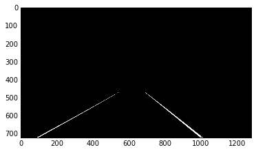

# Advanced Lane Finding

### Project Instructions
The goals / steps of this project are the following:  

* Compute the camera calibration matrix and distortion coefficients given a set of chessboard images.
* Apply the distortion correction to the raw image.  
* Use color transforms, gradients, etc., to create a thresholded binary image.
* Apply a perspective transform to rectify binary image ("birds-eye view"). 
* Detect lane pixels and fit to find lane boundary.
* Determine curvature of the lane and vehicle position with respect to center.
* Warp the detected lane boundaries back onto the original image.
* Output visual display of the lane boundaries and numerical estimation of lane curvature and vehicle position.

### Navigating this directory
* Project code is in `p4.ipynb`.
* The images for camera calibration are stored in the folder called `camera_cal`.  
* The images in `test_images` are for testing your pipeline on single frames.

## Project Outline:
The code for each step is in the correspondingly named section of `p4.ipynb`.

## I. Camera Calibration

### 1. Computing the camera matrix and distortion coefficients
This was done in Step 1 of the ipynb.
* Read in calibration images.
* Generate object points (points I want to map the chessboard corners to in the undistorted image).
* Find the image points (chessboard corners) using `cv2.findChessboardCorners`.
* Calibrate the camera and obtain distortion coefficients using `cv2.calibrateCamera`.

#### Example of a distortion corrected calibration image.

## Pipeline (test images)

### 2. Apply distortion correction to each image
* Apply `cv2.undistort` with the camera matrix and distortion coefficients obtained in Step 1. 

#### Example of a distortion-corrected image

### 3. Create a thresholded binary image

* Threshold x gradient (for grayscaled image)
* Threshold colour channel (S channel)
* Combine the two binary thresholds to generate a binary image.

#### Example of a thresholded binary image

### 4. Perspective transform
* Select only a hard-coded region of interest using a binary mask.

* Transform the image from the car camera's perspective to a birds-eye-view perspective.
* Hard-code the source and destination polygon coordinates and obtain the matrix `M` that maps them onto each other using `cv2.getPerspective`.
* Warp the image to the new birds-eye-view perspective using `cv2.warpPerspective` and the perspective transform matrix `M` we just obtained.

#### Example of a transformed image
Before (masked):

After:

### 5. Identify lane-line pixels and fit their positions with a polynomial

#### Identify lane line pixels
* Divide the image into `n` horizontal strips (steps) of equal height.
* For each step, take a count of all the pixels at each x-value within the step window using a histogram generated from `np.sum`.
* Smoothen the histogram using `scipy.signal.medfilt`.
* Find the peaks in the left and right halves (one half for each lane line) histogram using `signal.find_peaks_swt`.
* Get (add to our collection of lane line pixels) the pixels in that horizontal strip that have x coordinates close to the two peak x coordinates.

#### Fit positions of lane-line pixels with a polynomial
* Fit a second order polynomial to each lane line using `np.polyfit`.

#### Example plot
Polynomial fitted to birds-eye-view image:

Polynomial drawn on image using helper function `draw_poly`:

### 6. Calculate the radius of curvature of the lane and the position of the vehicle with respect to the center

* Code: `left_curverad = ((1 + (2*left_fit[0]*y_eval + left_fit[1])**2)**1.5) /np.absolute(2*left_fit[0])`

### 7. Plot result back down onto tho road such that the lane area is identified clearly.
* Warp lane lines back onto original image (car camera's perspective) using `cv2.warpPerspective`.
* Combine lane lines with original image (version corrected for distortion) using `cv2.add`.

Lane lines warped back onto original perspective:

#### Result: Lane lines combined with original image:

## III. Pipeline (Video)

[TODO: Link to video output](#)

## IV. Discussion

* TODO: Discuss any problems / issues you faced in your implementation of this project. Where will your pipeline likely fail? What could you do to make it more robust?

* Approach, techniques