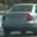
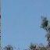
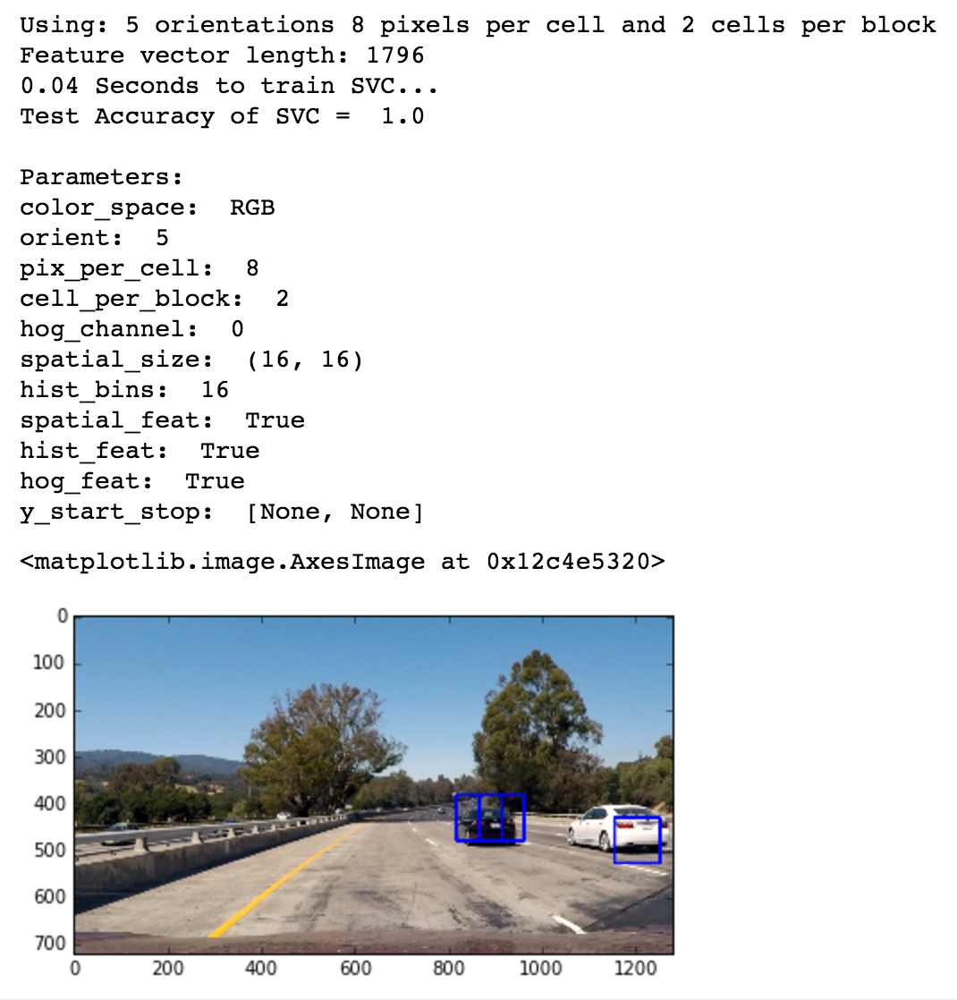
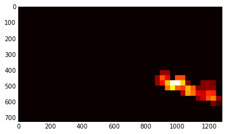
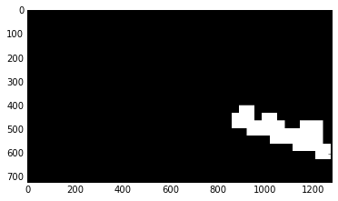

# Vehicle Detection

The objective of this project is to create a pipeline (model) to draw bounding boxes around cars in a video. This video was taken from a camera mounted on the front of a car.

This README contains info on:

1. Files in this repo
2. Project Outline
3. Project Process
   * Histogram of Oriented Gradients
   * Sliding Window Search
   * Video Implementation: Removing False Positives and Combining Overlapping Detections
4. Discussion

## 1. Files in this repo
* `p5-vehicle-detection.ipynb`: Notebook with final model
* `helperfunctions.py`: Helper functions for `p5-vehicle-detection.ipynb`
* HOG Experiment:
   * `hog_experiment.py`: Script to gather accuracies and collect images for different HOG parameter configurations.
   * `experiment_helper_functions.py`: Helper functions for `hog_experiment.py`
* `p5-for-tuning-classifier-parameters.ipynb`: Notebook structured for quick testing of different parameter configurations. Contained in a notebook because I had to assess the bounding boxes visually (as opposed to the HOG experiment where, although I saved the images, I could assess performance via accuracy alone (to intuit what to try next) and so could run it as a script.
* Logs from experiments:
   * `logs/`: Textual logs of experiment parameters and results (accuracies)
   * `colour_space_images/`: Test image 1 converted to different colour spaces
* README (repo and process documentation):
   * `README.md`: This doc!
   * `readme_images/`: Contains images used in this doc
* Given resources:
   * `test_images`: Images provided by Udacity to test my model on

## 2. Project Outline
The goals / steps of this project are the following:

* Perform a Histogram of Oriented Gradients (HOG) feature extraction on a labeled training set of images and train a classifier Linear SVM classifier
* Optionally, you can also apply a color transform and append binned color features, as well as histograms of color, to your HOG feature vector. 
* Note: for those first two steps don't forget to normalize your features and randomize a selection for training and testing.
* Implement a sliding-window technique and use your trained classifier to search for vehicles in images.
* Run your pipeline on a video stream and create a heat map of recurring detections frame by frame to reject outliers and follow detected vehicles.
* Estimate a bounding box for vehicles detected.

Here are links to the labeled data for [vehicle](https://s3.amazonaws.com/udacity-sdc/Vehicle_Tracking/vehicles.zip) and [non-vehicle](https://s3.amazonaws.com/udacity-sdc/Vehicle_Tracking/non-vehicles.zip) examples to train your classifier.  These example images come from a combination of the [GTI vehicle image database](http://www.gti.ssr.upm.es/data/Vehicle_database.html), the [KITTI vision benchmark suite](http://www.cvlibs.net/datasets/kitti/), and examples extracted from the project video itself.   You are welcome and encouraged to take advantage of the recently released [Udacity labeled dataset](https://github.com/udacity/self-driving-car/tree/master/annotations) to augment your training data.  

Some example images for testing your pipeline on single frames are located in the `test_images` folder.  To help the reviewer examine your work, please save examples of the output from each stage of your pipeline in the folder called `ouput_images`, and include them in your writeup for the project by describing what each image shows.    The video called `project_video.mp4` is the video your pipeline should work well on.  

**As an optional challenge** Once you have a working pipeline for vehicle detection, add in your lane-finding algorithm from the last project to do simultaneous lane-finding and vehicle detection!

**If you're feeling ambitious** (also totally optional though), don't stop there!  We encourage you to go out and take video of your own, and show us how you would implement this project on a new video!

## 3. Project Process
### I. Histogram of Oriented Gradients (HOG)

#### 1. Extract HOG features from the training images.

1. Read in all `vehicle` and `non-vehicle` images.
Here are two example images, the first from the `vehicle` class and the second from the `non-vehicle` class:
    * 
    * 

2. Use `skimage.feature.hog(training_image, [parameters=parameter_values])` to extract HOG features and HOG visualisation.
    * Wrapped in function `get_hog_features`.
    
Code in Section 1 of `helperfunctions.py`. Relevant functions:  `get_hog_features` and `extract_features`.

#### 2. Choose HOG parameters.

* I wanted to optimise for HOG parameters systematically, so I wrote a script `hog_experiment.py` that enables me to easily run through different HOG parameters and save the classifier accuracy, the HOG visualisation (image) and bounding boxes overlaid on the video frame (image).
    * I later used `p5-for-tuning-classifier-parameters.ipynb`.
    * I used a spreadsheet to note down the parameters used each time, the accuracy, training time and the quality of the bounding boxes for each of the six test images. (E.g. was each car detected? If so, how well was it covered by the bounding boxes (how many bounding boxes + did it cover the car in full or only partially?) How many false positives were there?)
* I then picked the HOG parameters based on classifier accuracies and looking at the output images. I would like to make this process more rigorous instead of sort of basing it on intuition. 
    * It was difficult to do this because the classifier accuracy was usually above 99% and was often shown as 1.0 even if the classifier later drew many false positive bounding boxes.
    * I later realised that the accuracy had been so high because I'd only been using 500 images from each category (vehicles and non-vehicles). But I still couldn't rely only on the classifier accuracy as a measure because a higher accuracy didn't always give me 'better' bounding boxes.

Code in second cell in Section 1.2.

#### 3. Train a classifier using selected HOG features and colour features.

1. Format features using `np.vstack` and `StandardScaler()`.
2. Split data into shuffled training and test sets
3. Train linear SVM using `sklearn.svm.LinearSVC()`.

Data preprocessing code in Section 1.2, classifier trained in Section 1.3.

### II. Sliding Window Search

#### 1. Implement a sliding window search.

1. Define windows to search using helper function `slide_window`.
    * Restricted search space to lower half of the image (altered value of variable `y_start_stop`) because cars only appear on the road and not in the sky.
2.  Implement sliding window search using helper function `search_windows`.
    * For each window, 
        * extract features for that window, 
        * scale extracted features to be fed to the classifier, 
        * predict whether the window contains a car using our trained Linear SVM classifier, 
        * and save the window if the classifier predicts there is a car in that window.

Code in Section 2.

#### 2. Show some examples of test images to demonstrate how your pipeline is working.  What did you do to try to minimize false positives and reliably detect cars?

* Measures to reliably detect cars in single images: I restricted the search space to only the lower portion of the image, i.e. the non-sky and mostly non-tree portion.

Sample image:

---

### III. Video Implementation

#### 1. Provide a link to your final video output.  Your pipeline should perform reasonably well on the entire project video (somewhat wobbly or unstable bounding boxes are ok as long as you are identifying the vehicles most of the time with minimal false positives.)

[Video result](output_v5.mp4)

#### 2. Describe how (and identify where in your code) you implemented some kind of filter for false positives and some method for combining overlapping bounding boxes.

Pipeline:
1. For each frame, apply the image pipeline and add the detected bounding boxes (positive detections) to a global list `bboxes_list`.
    * See function `add_bboxes` in *Section 4.1 Streamline image pipeline* in `p5-vehicle-detection.ipynb`.
    * See function `add_bboxes_to_list` in *Section 4.2 Convert image pipeline into video pipeline* in `p5-vehicle-detection.ipynb`.
2. Construct a heatmap from the most recent 20 frames of video (or using the number of frames available if there have been fewer than 20 frames before the current frame).
    * See function `add_heat` in *Section 4.3 Create heat map* in `p5-vehicle-detection.ipynb`. 
3. Reject false positives: threshold the heatmap.
4. Draw bounding boxes around the area of each labelled area detected.
    * Label image using `scipy.ndimage.measurements.labels`
    * Draw bounding boxes using helper function `draw_labeled_bboxes` in `helperfunctions.py`.

Sample image of heatmap:

Sample image of labels:

---

## 4. Discussion

#### 1. Briefly discuss any problems / issues you faced in your implementation of this project.  Where will your pipeline likely fail?  What could you do to make it more robust?

Blooper problems:

1. When building the video pipeline, my functions failed to detect any vehicles for one of the frames. This returned `AttributeError: 'NoneType' object has no attribute 'shape' `. 
    * It turned out there was no return object for my function.
2. My classifier accuracy was 1.0 for a long time. It turned out I'd only been using the first 500 images from each category (vehicle and non-vehicle).

Persistent problems:

1. I can't assess the strength of the parameter combination using only one instance of bounding boxes detected in an image. The bounding boxes detected by the same combination of parameters varies.
2. The pipeline still misses out cars often. It is especially likely to fail when there are shadows.
3. Interestingly the model performed much better when I didn't use spatial or histogram features. This shows that adding more features (even if they sound like they might help) can make a model do worse.
